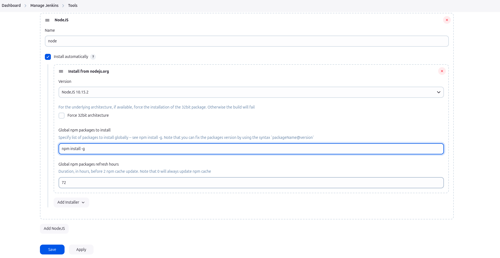
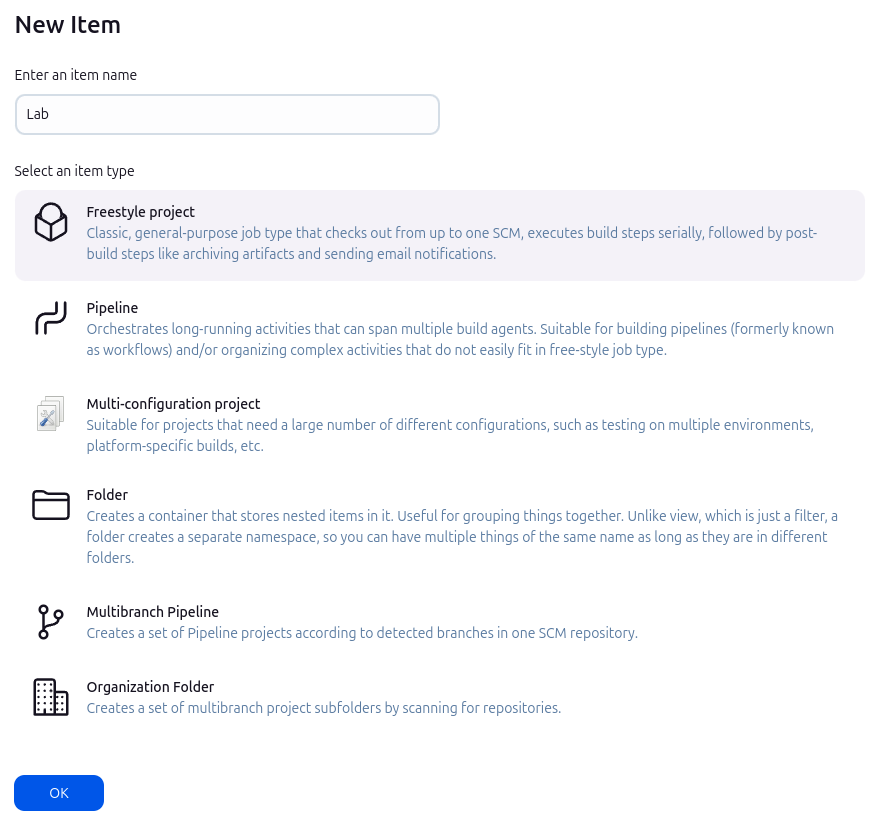
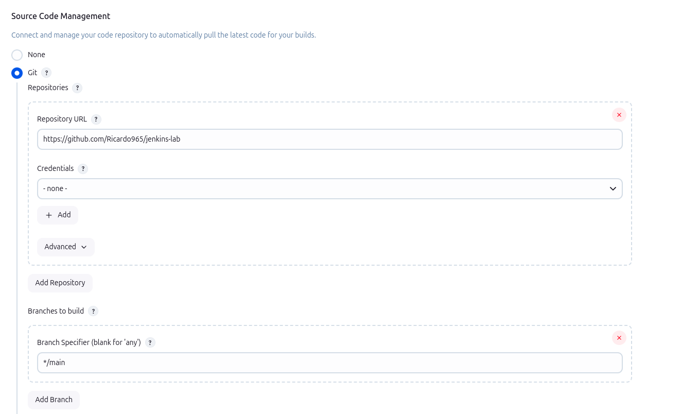
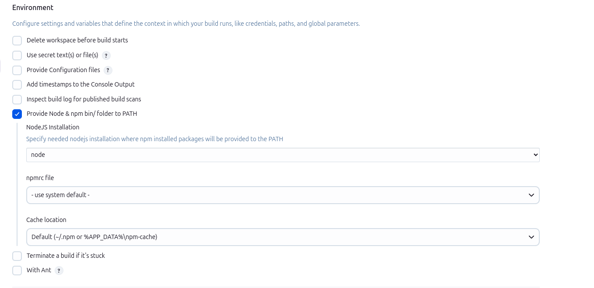
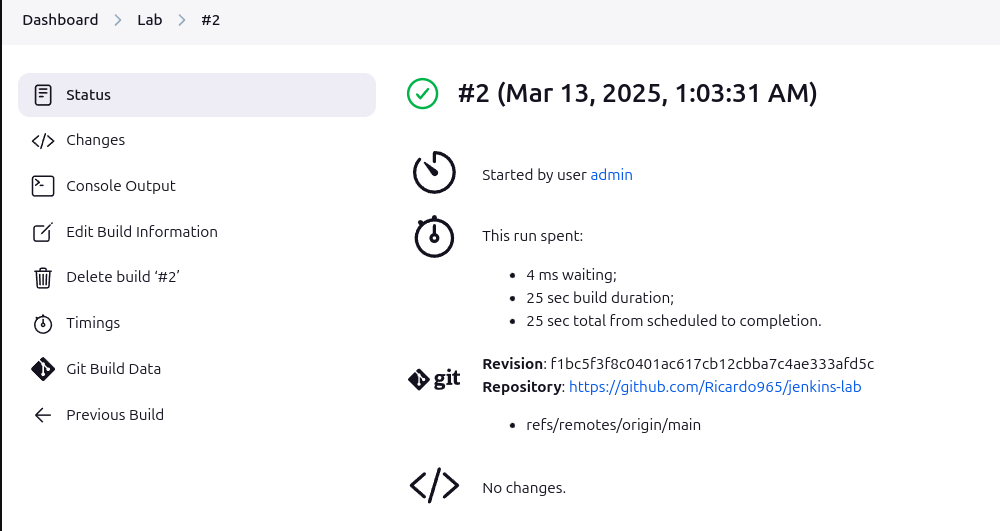
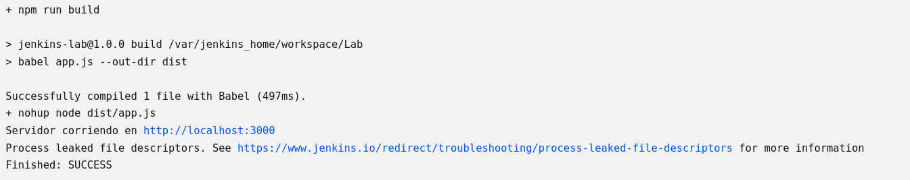
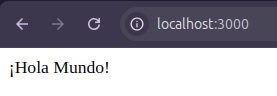

# Jenkins Lab

## Ejecutar Docker Compose

En la ruta donde está presente el `docker-compose.yml` ejecuto:

```bash
docker-compose up -d
```

3. Para extraer passwords

```bash
docker logs id_container
```

```bash
docker exec id_container cat /var/jenkins_home/secrets/initialAdminPassword
```

Con ello, obtengo la contraseña para acceder por primera vez en Jenkins

```
docker exec 977f19207109 cat /var/jenkins_home/secrets/initialAdminPassword

```

Obtengo la siguiente salida:

`395598ca6afe491599009a71904559be`

Posteriormente, accedo a la dirección:

`localhost:8080`

Esto nos muestra la contraseña para el primer acceso y despues instalamos los plugins sugeridos junto a la creacion del primer admin para el Jenkins Controller.

Vamos a Dashboard > Manage Jenkins > Plugins y vamos a instalar el plugin nodejs.

Una vez hemos instalado el plugin, nos dirigimos a Dashboard > Manage Jenkins > Tools.

Ahora vamos a crear una herramienta de NodeJS usando el plugin que hemos instalado. Debe verse algo como esto:



Una vez hemos creado la tool, vamos a crear un Item de tipo Freestyle Project



Vamos a configurar el repositorio para hacer el checkout como lo siguiente:



Y además vamos a configurar el Environment de este Item:



Y se configura el Build Step de tipo Execute Shell como lo siguiente para hacer que el proceso levante la app de JS y termine la ejecución dejando el servidor corriendo en background:

```
npm install
npm run build
nohup setsid node dist/app.js > output.log 2>&1 < /dev/null &
```

Comprobación de la ejecución del pipeline y de la duración:




